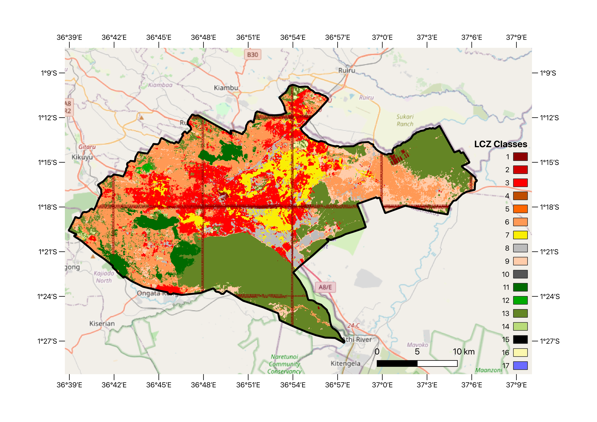

# Introduction

The last two weeks have been entirely dedicated to working on the model for LCZ zones. I will talk about experiment design and some preliminary results I've gotten from the model so far.

# LCZ Classification

As mentioned in previous posts, I intend to use the So2Sat LCZ42 dataset to train a model to classify LCZ zones in major urban areas. Choosing an initial case study was crucial for evaluating the feasibility of the project. The two main reasons for selection were:

1. There are So2Sat patches in said city
2. There are embeddings (AlphaEarth and TESSERA) readily available for the city for 2017

With that said, with Anil we had decided to work with Paris or Madrid. However, we had ignored on key factor: **change in land use over time**. (Most) major European cities have not had major changes in land use for urban expansion for the last decade, so seeing change in LCZ distribution over time was very unlikely. On the other hand, cities in Latin America and Africa have massively grown in extension so even in a 10-year span land use can vary a lot. I can talk about this from experience (see Bogotá in Google Earth). For this reason, Nairobi was an obvious choice and also because I happen to be working on a project with [Saitabau Kumary](https://adenkumary.github.io/) on building efficiency there.

## Model Design

Initially, I treated the problem as a classification task (the kind of cat vs dog in images), but after many different combinations of models and embeddings, the results were not promising. I tried using ResNet18 and ResNet50 with ImageNet weights and sensor-agnostic weights from `torchgeo` with both Tessera and AlphaEarth but none of them were able to perform at the same level as standard RF or MLP models that use pixel sampling and do not consider the spatial information. So with this is mind, I adapted Sadiq's U-net example for Tessera embeddings for solar power detection. In this case, it uses Dice and Cross-entropy losses to train the model, but it doesn't punish misclassification in areas where labels are not available, which is in pretty much all the ROI. And the results look pretty good, but I did encounter an issue with stitiching the tiles together. I tried the models with zero padding first and then reflection padding, but they still have a 32-px wide artifact in the edges. Worth noting that implementing reflection padding improved the models a bit.

In these models both Tessera and AlphaEarth perform similarly, at least according to training metrics. Below is a preliminary map Saitabau and I designed for his project. Interestingly, the best models were those trained using the medium size U-net, not the larger ones. Overall it is able to differentiate between built-up and natural areas, but it misclassifies some of the classes (notably water, which is not very present in Nairobi). It does well between the first 7 classes (compact and open). In those underrepresented classes is where simpler models perform better, but it's because they use a similar number of pixels per class.

Since I want to see change in time, I used the weights from these models to do inference on embeddings from 2025, but the results were reversed than what actually happened in Nairobi (the results show less densification of built-up areas).

A big shout-out to the team behind So2Sat dataset for kindly updating and correcting the georeferencing metadata for the patches. At the moment, I'm trying to do experiments with European cities, starting with London and then Paris.

# Other Stuff

I recently started working on a project to use ariborne images to evaluate vegetation health in Wales (details to be shared in time). Likely this will include some of the methods I've already used but incorporating ground surveys and drone imagery from the area.

In addition to this, the last few days have been pretty busy preparing and running the half-marathon in Cambridge (I survived, my left knee didn't 😂). Expect a post about how I used Gemini and Garmin data to prepare for the race.

Also, I've been preparing a visit from Colombian government officials to the university this coming week to commemorate the 10th anniversary of the peace agreement with FARC, which I'll be moderating and translating. This is the first of a series of seminars we will host at [CUCOL](https://cucolombiansociety.wixsite.com/home) until the end of the academic year in June. This comes in a very interesting timing, not only due to the context of international relationships in [the Americas in the last few months](https://www.bbc.co.uk/news/live/c9vx9zkn2pzt), but also because Colombia is going through general elections, which started today with [congressional elections](https://www.reuters.com/world/americas/colombians-vote-legislative-contest-presidential-primaries-2026-03-08/) and will end in couple of months with the presidential elections. So this is a good opportunity to showcase the work Colombian researchers are doing in Cambridge and hopefully draw some (much needed) attention towards R+D in the country.