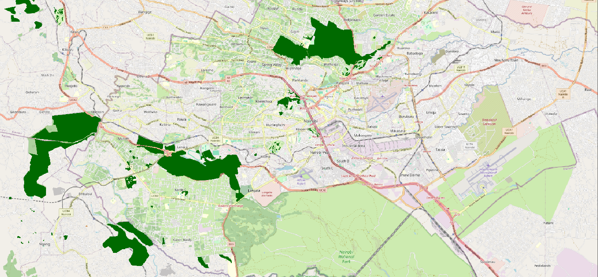
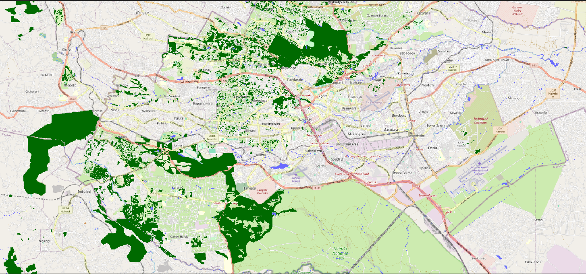

Hello!! I want to introduce you to `osm-rasterizer`, a package that I've been meaning to publish for a while now (available [here](https://github.com/ancazugo/osm-rasterizer)). It's sole purpose is to take features from OpenStreetMap (OSM) and rasterize them into a tif file with a given resolution. This is useful if you want to use OSM data as labels for machine learning models.

The way it works is by creating layers of features that the user can choose from using the OSM tags. `osm-rasterizer` will query said tags for a specific bounding box and burn the features into an image. The user can decide whether all those features are one hot encoded or not, depending on preferences.

Most importantly, `osm-rasterizer` uses Overpass API to query OSM data by date, so the user can specify a point in time from which the data is to be queried. This is a useful feature if you want features from different time periods.

## CLI Usage 

This is an example of extracting water and forest features in a single layer in Nairobi, Kenya as a case study, if you add the `--date` flag, you will get the data for that particular date. The resulting image is in the projected UTM CRS for the bounding box.

```bash
osm-rasterizer 
    --bbox "36.55363766400003,-1.442601803999969,37.06313313600007,-1.0646565169999689" \
    --feature 'water:{"natural": "water", "waterway": true, "landuse": "reservoir"}' \
    --feature 'forest:{"natural": "wood", "landuse": "forest"}' \
    --resolution 10 \
    --single-layer \
    # --date "2017-12-31" \
    --output nairobi_output.tif
```
::: {#figures layout-ncol="2"}



:::

The package is still in development so if you find it useful or have any suggestions, please let me know!