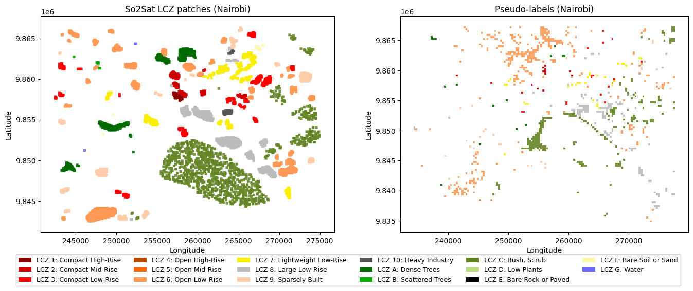

# Introduction

This is a short update on the Local Climate Zones (LCZs) classification project. It's a collection of notes and experiments I did last week particularly about using label propagation and other sources of information to increase the number of labels and/or features, namely using OpenStreetMap (OSM) data for labels (with `osm-rasterizer`), height data for buildings and a canopy height model (CHM) and label propagation to increase the number of labels.

## Label Propagation

So the label propagation has a few constraints. If done at the pixel level, it misses the context behind the patch labels, as these were done considering the entire scene. One road pixel can be any built type depending on what’s around. So I built a label propagation at the pixel label using the following steps:

- Aggregate embeddings (mean, std, max) per patch
- Generate 320x320 m grid and use Knn on the entire ROI
- Filter out <.8 confidence patch pseudo-labels

This approach effectively increments the number of possible patches to use in a classifier, but it presents one key problem: None of the cities have all possible classes, so for instance, Nairobi doesn’t have classes 4-5 in the labels even though they might be present there. Low representation also plays a role, as water has few labels and no pseudolabels.

Probably the best approach would be to do label propagation in multicity instances. At the moment, I'm trying to use Paris due to its size and varied LCZ classes, so I could combine the Knn results of the label propagation with those of Nairobi.

## Including other features

OSM data, at least for Nairobi is insufficient to get good labels for built types, because of lack of height information. For natural types it’s better, but quality is bad when going back in time, for instance, artificial lakes that were present in 2017 were not in OSM at the time. So the key here is to grab as many useful OSM tags as possible, including those that are currently deprecated as they might include useful information in the past (see previous tags for the [Ngong river in Nairobi](https://www.openstreetmap.org/way/25760438)). Claude was very helpful in this regard. I think OSM information is useful for natural types, and so far I've used the water class (G class in LCZs) because water bodies have a distinct spectral signature and there aren't many water patches for Nairobi in the So2Sat dataset.

I tried creating some manual labels for built types, but it is very difficult since many of those classes overlap in some way, as pointed by most research papers. With that said, I thought it would be a good oportunity to add some other features to the embeddings, in particular height data from trees and buildings. The reason behind this is that built-up density should get picked up by the embeddings and the CNNs, because it's information related to the spatial distribution of the features (plus their spectral signatures). However, Tessera doesn't have height data, which I believe is the reason why in most tests AlphaEarth performs better, as it was trained with DSM and DTM layers as well as Sentinel images. So, I'm testing adding the Meta's Global Canopy Height Model (CHM) and Google's Temporal Open Buildings dataset as features in the model. 
There are a few things to keep in mind about including these:

- Resolution (GEE does the re-sampling to 10 m resolution)
- AI predicted on AI-generated data: Both datasets are AI-generated, so not using the best available **human-labelled** data might be a problem.

## Model architecture

With the small literature review I did the previous week, most, if not all, papers that use the SO2Sat labels, treat the problem as a classification task. Aside from initial experiments, I've mostly treated this as a segmentation task, assuming that all pixels in a patch belong to the same class. In realit, it depends a lot on the context, even outside a given patch. 

This makes me re-evaluate the best way forward in terms of the model architecture, especially because most literature that I would use to benchmark my results talks about classification of the patches. 

Going back to the label propagation, what I did was to create a 320x320 grid and aggregate the embeddings (mean, std, max) per patch, and select those that have a significant score, and then feed them to the U-net with the original labels. So, in a way the label propagation is not done at the pixel level, which I think is the right approach. I will come back next week with updated results on these experiments.

