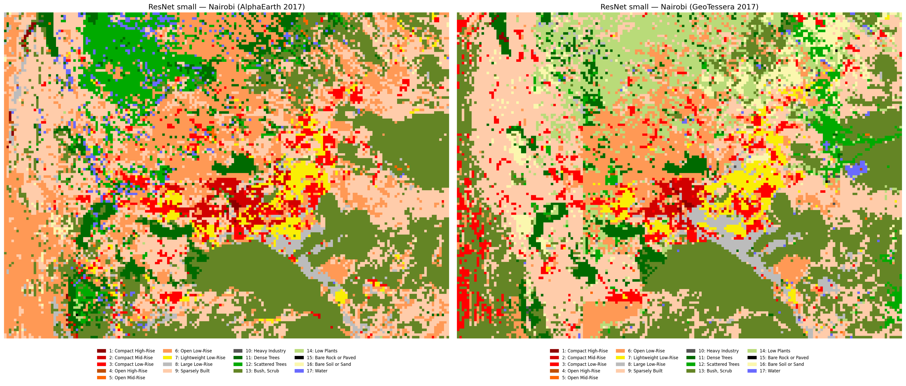

# Introduction

This is a big update on the Local Climate Zones (LCZs) classification project. I've been working on two different approaches since the last time.

# Background

As mentioned in previous posts, LCZs are generally defined at the neighbourhood or block level, thus the scale of most LCZ maps is at most 100 m with some even bigger areas of 300-500 m. This raises the question of what the best approach is to classify LCZs at a global scale. In addition, the So2sat LCZ42 dataset is a patch-based dataset, of 320x320 m patches. In all papers where this datasets is used, it is treated as a classification problem with Sentinel data as input, and sometimes using other data like Landsat.

With the help of Claude, I had developed models that could take the embeddings and clip them to the boundaries of some city and create a dataset using Torchgeo. However, I found that the code had become a bit unmanageable for me, resulting in weird artifacts and not reproducible pipelines when trying for other cities. On top of that, I wanted to be able to test models with multiple cities simultaneously, while working with both `zarr` and `tif` files. I'm not sure if this is a problem with tools like Claude or Codex, but the time you gain by just hitting enter in the CLI, you lose it in control and time trying to figure out why something works the way it does or doesn't do what you want. So, I decided to change my approach based on these three principles:

- Reduce dependencies, so no torchgeo or special modules. They are not discarded for now, but it reduces complexity and makes the code more readable.
- Modular design. Every single step should be a function or class that can be reused in other projects.
- Reduce the task to its minimal form. Simple enough that I could do it manually and the instructions given to Claude could reflect that.

Just to give you an idea of something that changed was plotting the inference results of a model. Now, there's a dedicated script just for plotting an 2D-array of integers, with a custom colormap and a legend for all LCZs classes present in the ROI. Seems trivial, but regardless of the model, I can just re-use this to visualise the results. 

Based on recommendations made by Anil and Sadiq, especially in his CNN example for solar panels. I manually designed the sampling module that takes one city, creates a grid and samples the so2sat patches randomly or using a user-defined pattern and splits the data into train/val/test splits. Then it rasterises the labels for the U-net, into the grid tiles. This makes the sampling and tiling easier when combining other datasets as labels, such as OSM or manual labels.

## Patch Classification

Using the train/val/test splits, I trained a small ResNet (using `timm` architectures) with both AlphaEarth and TESSERA embeddings and did multiple experiments with a couple of different cities, where data is available, including London, Paris and the aforementioned Nairobi.

## Semantic Segmentation

In this approach, I clipped the embeddings to the extent of each patch which, if done on the entire So2sat dataset, would be 400k patches, but in this case was only done for the same cities I used for the patch classification. Then, I trained a small U-net (based on Sadiq's CNN example for solar panels) and did the same experiments as with the ResNet.

# Conclusions

Augmenting the number of labels from other cities improves the model significantly, as expected. Now, I get water patches in Nairobi because the model learned what water looks like in the embeddings in European cities. AlphaEarth slightly outperforms TESSERA in semantic segmentation but TESSERA is better in patch classification.
Inference in other cities is a bit tricky. I tried inference of a big model trained on South American cities plus London and Nairobi, but Bogotá and Buenos Aires were very wrong, even if the model learned class distributions from cities that are expected to be similar (i.e. Santiago, Sao Paulo and Rio de Janeiro).

## Next steps

All of this was done with the current version of Tessera and my extraction of AlphaEarth from GEE, but I want to test the v1.1 version of Tessera for London, for which I got access recently, in addition to the Nairobi v1.1 embeddings I already had (kudos to Frank). With AlphaEarth, I found that some of the tiles that I originally downloaded have missing pixels and some weird artifacts so I'll be working on fixing that too. I saw [this repo](https://source.coop/tge-labs/aef) with a free version of the embeddings that is probably easier and faster to query than GEE.

Finally, motivated by [Michael's Minecraft rendering of LiDAR data](https://digitalflapjack.com/weeknotes/rendering%20156%20km%5E2%20of%20swedish%20forest%20in%20minecraft/), I wanted to test what the maps would look like on a small screen, specifically a 64x64 pixel screen, and this is a pic of the Tessera embeddings centered on the Eiffel Tower in Paris (light doesn't do it justice, it looks better in person).

{width=50% fig-align="center"}