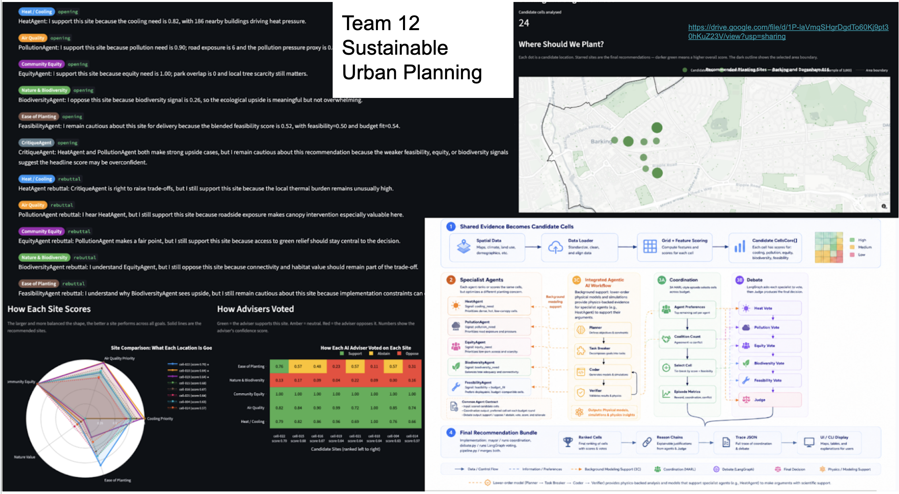

# Introduction

Last week I placed 2nd in the Hackathon for Multi-Agent Systems for Scientific Research, organised by [Accelerate Programme for Scientific Discovery (APSCI)](https://www.linkedin.com/company/accelerate-programme-for-scientific-discovery/) in collaboration with [Infosys](https://www.linkedin.com/company/infosys/), at the Department of Computer Science in Cambridge.

## Hackathon Experience

A month before the hackathon I attended the workshop on the same topic, where I learned to use Denario, which is a framework that facilitates every step of the scientific research workflow, from literature search to experimentation and writing. With that knowledge, I knew what the organisers expected the groups to develop. However, the first challenge was to find a group and a topic to work on, as I didn't know anyone when I arrived, so I joined a group of three other loners ([Carla](https://www.linkedin.com/in/carlamuntean/), [Gillian](https://www.linkedin.com/in/dr-gillian-g-056b23107/) and [Dawei](https://www.linkedin.com/in/daweichen830/)) and after brainstorming for 1 hour or so, we decided to stick to my idea of using multiple agents as urban planners, with the goal of using real data from London from the 3-30-300 paper to find the optimal locations for new green infrastructure. 

## Design

The first design of the project was prototyped by Carla, which uses denario to call different LLMs (but we only used GPT-4). The agents had access to these spatial datasets:
- Tree data from the 3-30-300 paper
- Ordnance Survey (OS) roads
- OS Green Spaces
- Verisk Buildings

In order to simulate a real life scenario, there were 7 different agents, each one with one goal in particular:
- **Heat Agent**: Maximize cooling benefit
- **Pollution Agent**: Reduce local pollution exposure
- **Equity Agent**: Improve environmental fairness
- **Biodiversity Agent**: Improve ecological connectivity
- **Feasibility Agent**: Keep the plan realistic and deployable
- **Critique Agent**: Stress-test weak assumptions and unresolved risk
- **Judge**: Aggregate debate-stage signals

The idea behind these different agents was to have them discuss from their perspective, based on a defined area (borough) in London, where this ROI was divided into a grid of user-defined size. Then the Judge would gather all the opinions and make a decision on where the best tiles to place a park or plant more trees are.

## Presentation

After struggling with making the team work with GitHub (pulling and pushing code), as everyone had different levels of expertise with Git, I managed to make the agent work with the UI that I had designed with streamlit, 30 minutes before the deadline and then we had some 20 minutes to prepare 1 slide for the 1-minute presentation.

During the quickfire round it was one group after another with no time for questions. The judges were verys strict with time. In our team we had decided that I was gonna speak as I was the one with more context about the project, after all, I suggested the idea.

# Conclusion

Overall it was a very valuable experience, not only in terms of learning new things like how langgraph works or how to make agents talk to each other, but also because in real life scenarios, more often than not you will have to work with people with different backgrounds and expertise, and coming to an agreement is not always easy, let alone creating something works in such a short period of time. This is something that I will definitely try to repeat in the future. And also, it might be worth exploring this urban planning scenario as a fun closing chapter of my PhD.

I would like to thank my team for supporting my idea from the beginning and for working reallly hard during the event.