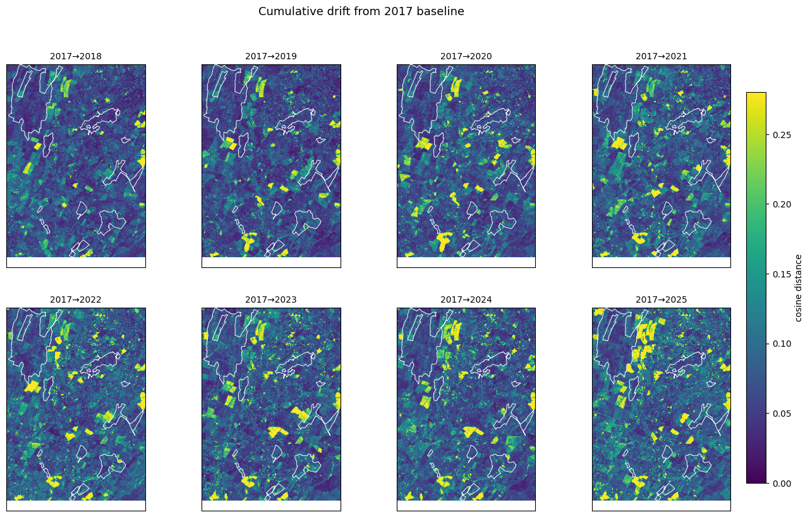
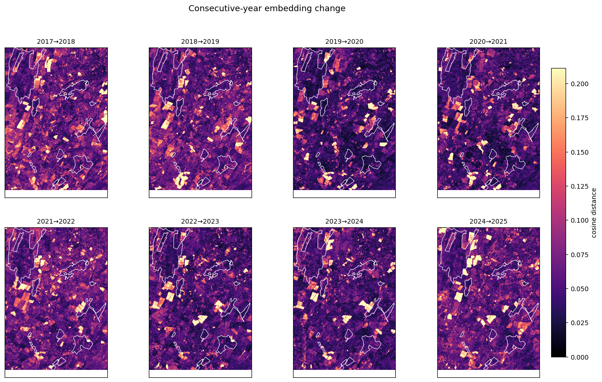

# Introduction

In the Anglesey project with the North Wales Wildlife Trust (NWWT), we've been working on measuring vegetation health from satellite images. The fenlands are composed of 5 sites that are separated by a combination of private land, some roads, and some building in North Wales. 

# Data

The data that I've used is mostly Sentinel 2 images dating back to 2015. I've used a combination of different metrics, including NDVI (Vegetation Index), NDWI (Water Index) and EVI (Enhanced Vegetation Index). However, I realised that the first two are not that informative for vegetation health or moisture content in the fenlands, so I have been testing NDMI (Normalized Difference Moisture Index). 

# Sampling

One of the goals of the NWWT people is to do a ground-truth validation of the vegetation and measure some metrics like water table, plant IDs, etc. They requested if I could select some specific coordinates for them to measure these environmental variables. Initially, I used some of the spectral indices to get the most representative pixels in terms of moisture, chlorophyll content, and even flooding profile (based on Sentinel-1 data). But then, I thought that basing sampling on just one metric was problematic as I might be missing out on the spectral signature of other bands that are not used in NDMI for example. For this reason, I decided to use Tessera v1.1 to select those pixels most representative of the spectral signature of the fenlands.

I tried using Tessera to measure change year-by-year from 2017 and using that year as baseline until 2025, as seen in the two pictures below. The interesting part is that the fens themselves haven't changed significantly, at least based on the embeddings. However, the surrounding crops have changed, as seen in the bright yellow spots. Unfortunately, most of those areas are private land so ground validation is not possible.

There were some discussions as to the size of the patches to sample in each site, because satellite data and the embeddings are 10 m resolution, but in between the ground error of satellites and GPS errors, we couldn't rely on a single pixel as an appropriate patch. I suggested the people from NWWT to use 20 by 20 m patches in their field work, as that would be small enough to be covered by a couple of pixels in any spatial dataset while also being not big enough for ground truth validation.

The people in NWWT have access to a previous plant survey done more than 15 years ago. The idea is that when the conditions are warmer, i.e. late July/early August, it will be ideal to see the stress of the fenlands and validate what we have seen from the satellite images.

This field work will be done with volunteers who will be trained on how to identify key/representative plant species as well as how to use the equipment to measure pH, etc.