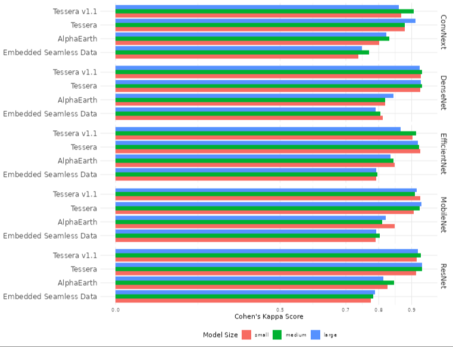
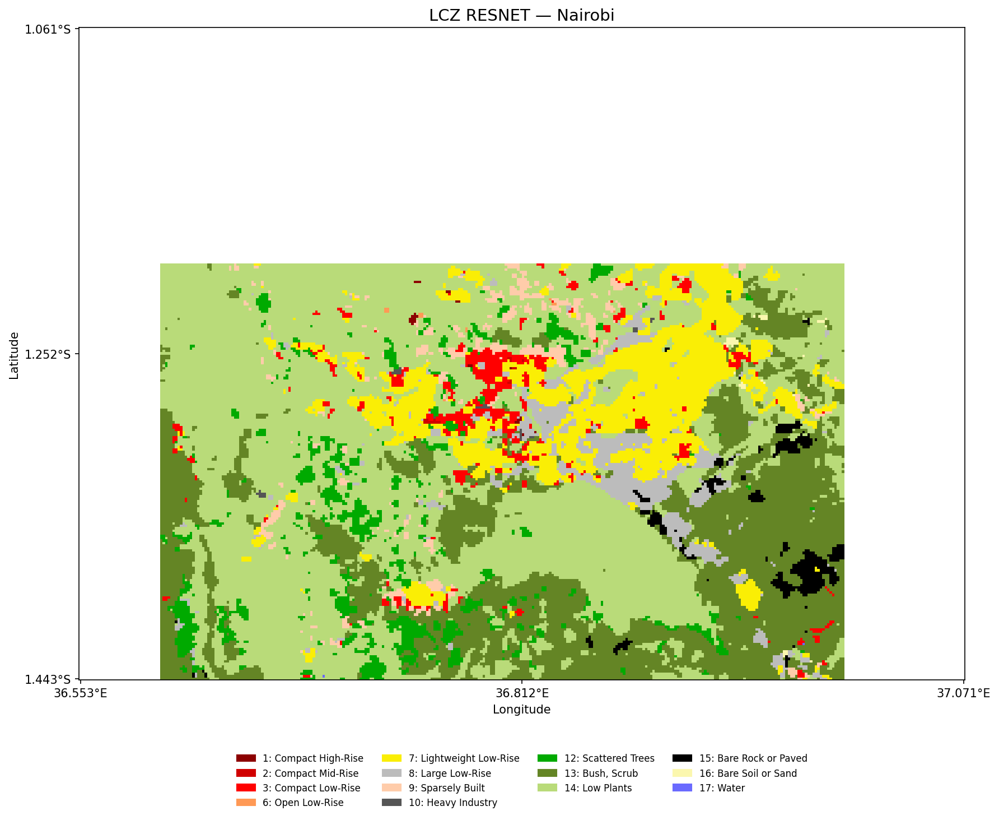
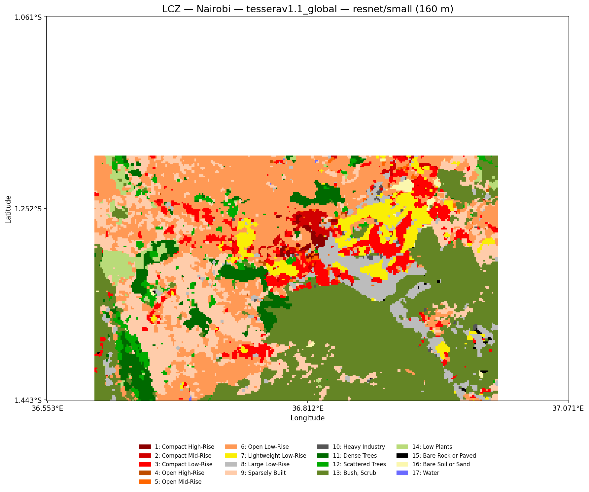

# Introduction

This is BIG update on the Local Climate Zones (LCZ) classification problem. I will talk about different patch classification methods I've used and the results I've got so far. 

TLDR: Tessera v1.1 outperforms heavily other foundation models. My best result so far with a simple model is 0.61 Kappa Score for the So2Sat labels. More complex models increase it to 0.65. 

## Embedding changes

Due to the earlier experiments I made with nairobi and London, we had come to a conclusion that the Tessera artifacts were affecting the classification performance, so I changed them to the v1.1 version (thanks to Mark and Frank). I had to make a big request to generate the 2017 tiles for 52 cities around the world, which covered the entire So2Sat dataset. 

In addition to this, I changed how I was accessing the AlphaEarth embeddings. I used to download them from GEE using `xee` so they were handled as xarray objects. However, in the tiling (that I forced it to be 0.1ª, just like tessera), some weird shapes were introduced that were visible in the predicitons. So I changed now I'm using the [Source Cooperative](https://source.coop/tge-labs/aef) version of AlphaEarth, which is easier to access and they give you a vector file with the global grid of tiles for all years. I then use this vector to request the specific tiles I need. **In this blogpost I will refer to this dataset as coop.**

Finally, I adapted the code to include the [Embedded Seamless Data (ESD)](https://data-starcloud.pcl.ac.cn/iearthdata/64) that uses Landsat data, instead of Sentinel-2. It's resolution is 30 m, which differs from the 10 m of Tessera and AlphaEarth. On the other hand ESD goes back until the year 2000 and only has data till 2024. One thing to note, downloading this data was EXTREMELY time consuming, as the tiles are georreferenced using the Military Grid Reference System (MGRS), and there is no API, so I (Claude ofc) had to create a script to generate the MGRS codes of the tiles I wanted and I had to manually download them one by one.

## Current benchmark

As I've said in previous iterations of the blog regarding this project, Local Climate Zones are by defined by 3 main factors: (i) land cover (LC) (i.e. built-up or natural), (ii) density of the LC (i.e. forest or downtown), and (iii) height of the LC (i.e. low-rise or high-rise). There are 17 classes in total. The so2sat dataset is the only global dataset that has been manually labeled and is the one most papers use to test their models. In general, the papers use the overall accuracy and the kappa score to measure their performance. Most papers use the raw Sentinel 1 and 2 data with a combination of different architectures for image classification, such as transformers, resnets, densenets, etc. Currently, the best result from a paper is an accuracy of 0.73 and 0.74 from [Zhong et al 2025]() and [Lin et al 2024](), respectively. Zhong et al 2025 uses Prior Knowledge Coupling to resolve for similar classes, such as class 6 and 9, while Lin et al 2024 uses semisupervised learning on the So2sat dataset.

## Dataset split

A few things to note about the So2Sat dataset that are relevant from now onwards. In the original paper, the 400k patches cover 42 cities plus an additional set of 10 cities that are used for testing and validation. This data split is called the **cultural split**, and all of the papers use this split to test their models. In the 42 original cities, all of the patches are used for training, while the remaining 10 cities have some validation and testing patches. For instance, London is one of the training cities and Nairobi is a validation/testing city.
This split creates some problems because high-rise buildings don't look the same in London and Nairobi, regardless of the type of model. For this reason, I created a per-city grid split, following the solar grid tessera example by Sadiq. This split is called the **grid split** and uses data from all the 52 cities where the patches are located. Nonetheless, any model with this split is not directly comparable to the cultural split from my models, or from any of the papers, as the data distribution is different.

## Models
As readers have probably guessed, and as I mentioned before, the LCZ model from almost all papers is treated as an image classification problem. The reason for that is that by definition LCZs are defined by several features simultaneously, so it is not rare that in Urban Climate papers, LCZs are even defined at the neighbourhood or block level, which is way coarser than the resolution of Sentinel or Landsat products, thus the embeddings. A reflection of this is the 320x320 m resolution of the So2sat patches, which is even bigger than what the [Demuzere et al 2022]() dataset uses (100x100 m). In practice, this means that a pixel in a park can be a tree but if it's between many buildings and roads, it wouldn't count as one fo the natural classes but as one of the built-up classes. This is why the LCZ classification problem is treated as an image classification problem, and not a pixel-wise classification problem.

With that said, I've been using the `timm` library to access different architectures. Most of the 150 mruns I've done in the past few weeks have been using the ResNet family of models, but I've also tested DenseNet, EfficientNet, and ConvNeXt. Following the same template of the U-Net architecture, I have labelled the different architectures by the number of parameters, so nano resnet is in reality a ResNet18, while the large resnet is a ResNet152. The same goes for the other architectures.

## Experiments

### 1 + 1 city models

Now for the fun part and a recap: I initally wanted to optimise a model for one city, Nairobi, with the grid split and after testing with different embeddings and models, the best mdoel was AlphaEarth, followed not by long by Tessera (v1) and then by ESD. Then, I tried incorporating other cities in the training, so I included Paris and London, mostly because those two have many of the patches in the dataset, and include classes that are not present in Nairobi, and vice versa (Nairobi has class 7, which is not present in Paris or London).

Having more information, as expected, improves performance, regardless of the model. However, increasing the number of parameters, i.e. going from small models to larger ones, does not improve performance. In fact, the best model was the small ResNet34. Interestingly, with this 1+1 city models, I introduced Tessera v1.1 and the coop embeddings and this was the first time that tessera outperformed AlphaEarth. ESD kept coming last, unfortunately.

In these experiments, I also had a go at other architectures and only DenseNet came close to the performance of the ResNet models. So because of that I decided to stick to ResNets for the rest of the experiments. 

### Linear Probe

I already had a World Record (WR) to beat (in sports terms), but I needed to know how good the simplest model could be, basically, what is my floor as compared to my ceiling. In the initial stages of the project I had performed Random Forest classifiers on some of the pixels for the patches in Nairobi, but again, LCZs need spatial context to be defined, so I read a post by [Craig Robinson](https://geospatialml.com/posts/aef-census-block-embeddings/) about using EO embeddings with census tracts and I decided to try something similar, just in this case, my census tracts were the 320x320 m patches for the 400k labels. I tried averaging the embeddings (GAP) by band and then using that in a simple model (basically an MLP). This was done with the 3 embedding families separately and the results are down below. Interestingly, adding the standard deviation to each band didn't improve the model.

|Run name|Embedding|Accuracy|Kappa|
|---|---|---|---|
|dark-cosmos-254|Tessera v1.1|0.61|0.57|
|twilight-jazz-255|AlphaEarth|0.54|0.5|
|cool-salad-256|ESD|0.5|0.45|

### Cultural Split models

Now for the real test. After acquiring all of the embeddings for the 52 cities, I extracted the 32x32x128/64 pixel arrays and trained the resnets using the cultural split and the results were clear from day 1: Tessera outperforms both AlphaEarth and ESD, by a considerable margin. I'm not exactly sure why AlphaEarth is behind, given that LCZs are also defined by height and Google used some DSM and GEDI to create the embeddings. On the other hand, the SO2sat dataset was labelled by experts based only on Sentinel-1 and 2 data, so maybe the height information is not as relevant in these models specifically. But in the original So2sat papers and in many other sources it is always stated that LCZs are notoriously difficult to classify because they are context-dependant, so even in the So2Sat paper there are some discrepancies between the experts.

This is where I got stuck for a couple of weeks, I tried training the models but they were stopping because the validation was not improving after a couple of epoxhs. I was getting worse results than chance for any embedding/model combination. That was until Fable 5 was released (the first time), and I asked it to explain why I was failing. It turns out that my cultural and grid labels were getting mixed, so I was training with the grid labels, even though the patches themselves were the cultural split. After fixing this small but costly bug, I was finally able to train a model with the three embeddings with resnet, and I got the best results so far (with some tweaking): Tessera v1.1 (opt3-lr5e-4-warmup3) got accuracy of 0.65 and kappa of 0.62, while AlphaEarth (wandering-firefly-167) got 0.56, and 0.52, and ESD (good-flower-268) got 0.55 and 0.51, respectively. This is what a map of Nairobi looks like with tessera with the best model:

### Grid Split models

As mentioned before, I also re-assigned all the patches to one of the train/val/test datasets based on a grid for each one of the 52 cities. I followed the same procedure as the other models and the results with these are markedly better than with the culutral split. I'm sure that these results are because LCZ classes are very different from city to city (or even by continents), so there is a problem with spatial autocorrelation. Even though, this model performs better and there is no data leakage, it struggles generalizing to any other city that is not in the So2Sat dataset. However, Tessera is still performing better (accuracy: 0.85 and kappa: 0.84); AlphaEarth (0.83 and 0.81); ESD (0.77 and 0.75).

# Next steps

After going back and for with LLMs, and reading a bit more about the strategies other papers have used, I'm trying to do a teacher+student model with pseudolabels from the Demuzere paper. There are two things to keep in mind here: Demuzere labels are very noisy, they don't even match many of the So2Sat labels, and the resolution is different, so some resampling would be necessary. I'm also in the process of combining the tessera and alphaearth embeddings to see if that actually improves the predictions.