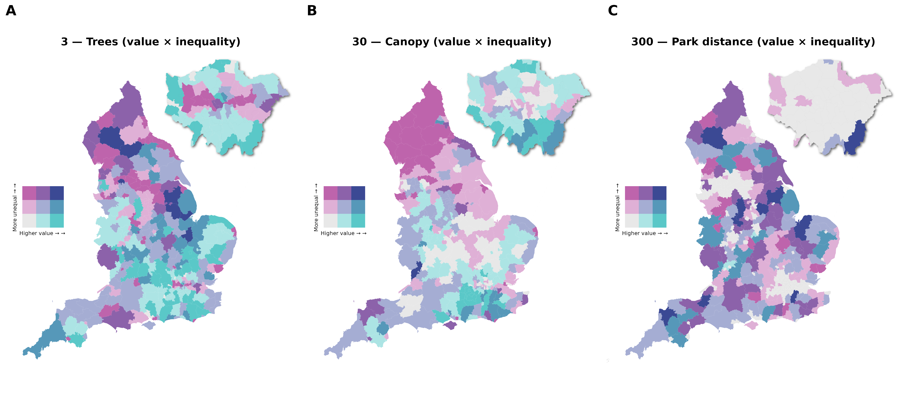

# Introduction

This will mostly be a recap of the 3-30-300 project and the paper I have re-submitted. I will talk about a python package I've been developing based on the code I created for this project.

## Paper

A couple of weeks ago I got the reviewer comments for the paper of the 3-30-300 project in England. Just to recap, the 3-30-300 aims to create a rule of thumb about greening thresholds for cities to attain: 3 visible trees from every home, 30% tree canopy cover in every neighborhood, and 300 m to the nearest green space. I attempted to measure this at the highest resolution possible and for the entire country of England. I also included some remote sensing metrics and inequality evaluation of the rule against the Index of Multiple Deprivation (IMD).

## Reviewers Comments
Most of the comments were good but some key points were highlighted. Notably, they wanted me to focus only on the green aspect, and set aside the blue infrastructure because it didn't add much to the discussion and I didn't even calculate the metric as it came from one of the datasets. 

Another valid comment was that I was measuring visibility as proximity, which is not exactly the same thing, because obstructions by other buildings are possible and the height of buildings also affects visibility, thus higher buildings have a higher chance to see more trees than a regular house. In this regard, the reviewers wanted me to test other methods or justify my choice.

Finally, regarding the inequality analysis of the 3-30-300 rule, I had only done it for the 3 and 300 components, which were calculated at the building level (21M houses), but the 30 part was done using census tracts so there was no inequality analysis for that part. The issue is that in literature, canopy cover is always the most crucial aspect of urban greening strategies, as having more canopy cover is associated with less air pollution, heat reduction, etc. They suggested that I should aim to measure it at the same scale.

## Changes to the paper

The first change I made was updating `Apache Sedona`to the latest version, and then I integrated Sedona's capabilities for raster data with the buildings dataset to perform zonal statistics. This time, I generated buffers of 100, 200 and 300 m around each building, and calculated the canopy cover. Running this took a couple of days for all the buildings in England. I did a sensitivity analysis for the three buffer sizes and there weren't significant differences between them but, canopy cover tends to decrease as you make the buffer bigger, which is expected.

The reviewers also suggested doing a sensitivity analysis for the buffer sizes used to count the number of trees around each building. The attainment of this component of the rule definitely changes with the distance. But, as I had done in the intial version of the manuscript, I had used the coefficient for the exponential regression between distance and number of trees as a proxy for visibility/proximity to trees. I had to make it more explicit in the manuscript and in the figures. In addition to this, when I made the original pipeline for the tree segmentation for the paper, I had used the `lidr` package in R with some parameters that I had chosen empirically, but I hadn't explained them thoroughly in the manuscript. Now this part is added in the supplementary methods.

I removed any mention of water as suggested by one of the reviewers, which meant that NDWI was chopped and the water distance inequality was too. I also felt from the beginning that these were not adding much to the paper and could be further explored in a different project with more rigurosity about blue infrastructure.

With these changes, I recalculated the Gini coefficient for the three metrics, something that wasn't done in the original version. This added a more complete picture of green infrastructure inequality. How I built these Gini metrics was using a corrected version of the formula for each census tract, assuming that residential buildings are the units of analysis and each one of the 3-30-300 metrics are the "wealth" variable.

Finally, one of the big changes I made for the revised manuscript was the adoption of the 2025 version of the IMD, which in the big picture doesn't change the interpretation of the results, as the trends remained largely the same, but what it meant was that I was using the latest statistical geographies for all the different analysis, which is important because I didn't have to join polygons from different years, because Output Areas (census tracts in England and Wales) canappear or disappear with each version released by the Office for National Statistics (ONS).

# Greenpy (Name to be changed, suggestions welcome)

While working in the revision of the paper, and making as much use of Fable 5 while it was available at the beginning of June and in the last week or so, I transformed the code I had for this paper and made it a library that can measure the 3-30-300 rule for any set of buildings, provided that the user has all the necessary information, including, building footprints, road network, trees, parks and a canopy raster. Not only it does so, but it also gives the user the option to choose some of these dataset from OSM, which makes it more accessible for areas that do not have an extensive and rigurous spatial infrastructure as the UK. In addtion to this, it also adds support for some datasets from `GEE` like Meta's world canopy cover, from which the user can calculate the second metric. At the moment I'm working on adding support to a form of true visibility using viewshed analysis, but I didn't want to include this in the paper and I want to validate this in some way, because visibility depends on factors like window size, orientation, obstruction, etc. 

At the moment, I am testing this with the project with Polly Hudson on measuring green inequality vs poverty in Charles Booth's maps of London. The buildings are vectorised and some parks are present but the roads have become the biggest obstacle to measuring walking distance to parks.