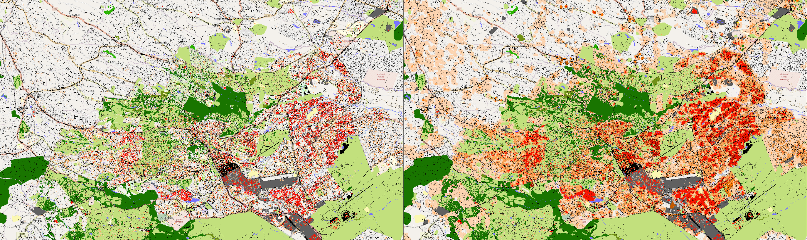
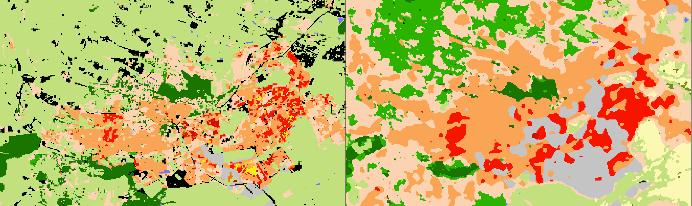
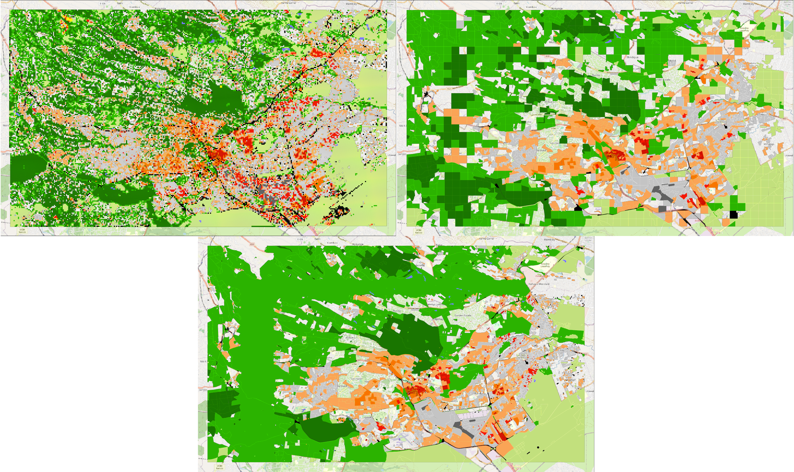
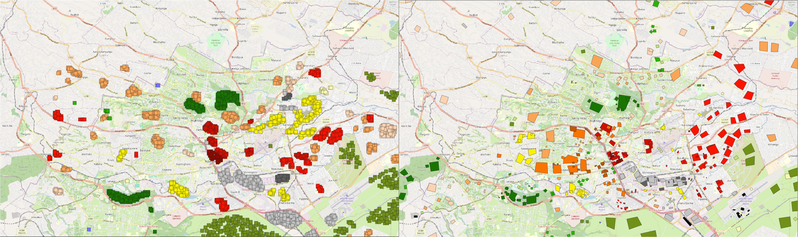

# Introduction

This is a follow-up on the LCZ classification (segmentation 😲) project. I'll mostly talk about using OSM through Overture as a way to improve labels for a model using Tessera/AlphaEarth and also as a way to directly estimate LCZ and urban canopy parameters (UCP).

**TLDR:** If you want to see the results of everything discussed here, you can check the map [here](https://share.geolibre.app/ancazugo/lcz-classification){target="_blank"} (give it a couple of seconds to load all the layers, and turn them on and off).

# LCZ Definition in Urban Climate Circles

In previous posts I have talked about similar approaches using satellite images to map LCZs in certain cities or even globally. I've mentioned that these classes occur at a local or neighbourhood scale, as they depend on the morphology of the urban area, and in particular, of density and height of its features. When they first appeared in the literature in the early 2010s (Oke and Stewart), they were defined using features such as sky view factor, canyon aspect ratio, impervious surface fraction, anthropogenic heat flux, material reflectance and some other specific features that are not clearly visible from space, or at least not from non-commercial products; and even if they were, they probably wouldn't be at available at the resolution required to map LCZ. 

## Morphometry

I had recently read a [paper](https://www.sciencedirect.com/science/article/pii/S2352938526002685) about using morphometry variables (using Overture Maps) and Sentinel 2 images to classify LCZs through the use of [`momepy`](https://docs.momepy.org/stable/), created by [Martin Fleischmann](https://martinfleischmann.net/) (same developer behind `geopandas`), and I thought that maybe using OSM features could help me create some labels to support the So2Sat dataset I have been using in my models. 

## Semantic Information

Nonetheless, in our meetings with Anil we have have discussed the potential of the OSM tags in giving information for certain classes, such as industrial, and green parks. As is well known, OSM data is incomplete and biased to certain areas, so the fact that something is not labelled with a certain tag does not mean that it is not a park/factory/ or other feature. This is particularly true for natural classes (A-G) which are not as common in urban areas.

With that information in mind, I started exploring options into how I could tackle the incompleteness of LCZ labels, so I tried first doing a **semantic mapping** of a couple of cities using my own `osm-rasterizer` package. This is essentially a rule-based approach to LCZs based on the tags in OSM features. The definition and how each class is defined is not as objective, but I used the work from [this paper](https://ieeexplore.ieee.org/document/7924630) to replicate, plus some additions that Claude suggested. The results are not ideal in the sense that it works for a very well known city like London, but anything in the Global South has a lot of noise like in Nairobi.

## Previous Work

So, using OSM data to map LCZs is not new and it's something that I've tested before through the [Geoclimate package](https://geoclimate.readthedocs.io/en/latest/), created by Jérémy Bernard a couple of years ago. It uses features from OSM directly to estimate LCZs and UCPs for a given bounding box. It is very useful but depends heavily on the completeness of OSM data. Plus, running a big city like London can take a couple of days, so it doesn't scale up very well, let alone for multiple cities.

# lczkit

Then, I tried combining both Geoclimate's approach with Overture and `momepy`'s morphometry features to create [`lczkit`](https://ancazugo.github.io/lczkit){target="_blank"}, which is entirely coded by Claude, but it made decisions based on the literature. So, basically, I transformed the fundamental urban climate literature on morphomeetry definitions of LCZs into text that the LLM used to create a rule-based approach to mapping LCZs. This uses Overture for one reason: it includes height data from Google and Microsfot, which is a crucial variable in separating built-up classes. The Overture API lets the user define the provenance of some of its features so `lczkit` can work entirely with pure OSM data (no ML-derived features). Then, it uses those features and momepy to define those classes in two units: patches and blocks. Patches are what you would use normally in spatial modelling (similar to the So2Sat-LCZ42 dataset I've been using) and blocks are defined by the street network, which goes in parallel to how researchers define LCZs in [WUDAPT](https://www.wudapt.org/)[^1] with irregular polygons. It also uses `earthengine-api` to get some Sentinel-derived datasets like WorldCover and GHSL, for land cover classes (A-G) and building height data where Overture is not complete. Now, the frontend of the app is built using `tippecanoe`and `PMTiles` tilesets and it lets the user visualize different parameters and metrics calculated by the package, including the urban canopy parameters (UCPs) and, of course, the LCZs. 

`lczkit` is still in early stages and I'm testing at the moment if the results are consistent to other labels from So2Sat or WUDAPT or tool generators like Geoclimate, or even the Demuzere global dataset.

Not only did I get to create this library from scratch, but I also got to play around with [Geolibre](https://geolibre.app/), which is a web-based GIS software, kinda like having QGIS in the browser. Even though the images comparing the different methdologies are here, it's better to see them at the same time and play with them, so after one day battling with the user interface and the sharing options in Geolibre, [I managed to make it work](https://share.geolibre.app/ancazugo/lcz-classification){target="_blank"} (give it a couple of seconds to load all the layers, and turn them on and off). It's important to save all to tifs as COGs, and if possible embed the color palette as metadata, so it actually renders in the share link.

[^1]: While developing all of this, I found the Zenodo of the WUDAPT labels that the community has submitted. They belong to the years between 2020 and 2024, so they don't overlap with the So2Sat (2017), but they have a bigger coverage, with less quality. It's useful for comparison and finetuning models. 