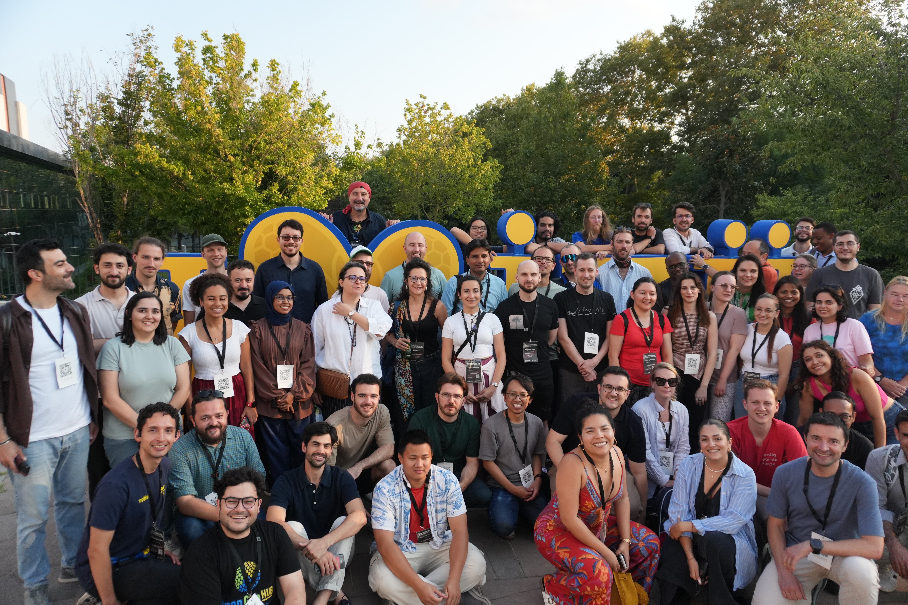

# Introduction

This entry in the blog post is a special one as it's my first summer school during my PhD. I attended the [Earth Observation Summer School by the OpenGeoHub Foundation](https://opengeohub.org/2026/01/29/earth-observation-summer-school-2026/) at the Technical University of Istanbul (ITU).

# Lectures

The school was full of theoretical and practical session of several topics related to remote sensing and spatial computational methods. In addition to this, there was a lot of coverage about the university as a hub of aerospace engineering and in general about Turkish Earth Observation landscape. 

I particularly enjoyed my conversations and talks with spatial R guru [Jakub Nowosad](https://jakubnowosad.com/). I recommend checking his blog and his pacakges for anyone doing anything geospatial. His talk in spatial sampling and machine learning was the highlight of the summer school for me, which thanks to him, is available in his [blog](https://jakubnowosad.com/ogh2026/docs/validation.html#/title-slide). Also worth highlighting was the introduction to `[Torchgeo](https://torchgeo.org/)` by one of his creators, Adam Stewart. It was a very insightful talk, especially for non-ML people, but it was a good reminder for some key concepts. Luckily, in Torchegeo's [youtube channel](https://www.youtube.com/@TorchGeo) he publishes more in-depth lectures on spatial machine learning. These two talks were the ones that got me thinking about the right approaches in experiment design and the implementation for the LCZ project and how I can integrate other labels into the ML model with the foundation models.

Other very interesting talks were the introduction to the physiscs behind SAR technology by [Professor Esra Erten](https://www.linkedin.com/in/esra-erten-54064b26b/) from ITU and the introduction to [SpatioTemporal Asset Catalogs (STAC)](https://stacspec.org/en) by Mustafa Serkan Isik, which is taking off in the geospatial community.

For anyone reading this who is interested in the content, OpenGeoHub has a [youtube channel](https://www.youtube.com/@OpenGeoHubFoundation/featured) where they publish the lectures from the summer school. I recommend checking it out if you are interested in any of the topics mentioned above, or even in previous editions of the summer school. I'll be watching some of the ones I missed in the parallel sessions (can't be in two places at once 😅).

# Hackathon

Throughout the week, we had the chance to take part in one of three hackathons through Kaggle. The first one was about measuring Biomass in soem parts of Spain from pre-processed data. The second one was about estimating the soil moisture of certain weather stations in Northern Europe (Denmark, Netherlands) using covariates they had already prepared for us, but it was possible to use any other dataset we deemed useful. The last one was about a couple of pre-summer school challenges. All these challenges were tracked in Kaggle with a test dataset, for which we only had the covariates and the target variable was hidden. We could see the leaderboard, which was calculated using the RMSE of 37% of the test dataset. The idea was that in the final day, the organisers would recalculate the raking with 100% of the test dataset. 

As non expert in any of the domains in the challenges, I thought I would give it a go at the [soil moisture problem](https://www.kaggle.com/competitions/modeling-monthly-soil-surface-water-content/overview) as it involved doing some spatiotemporal modelling because the weather stations had data from the year 2000 until 2024, with the test data all belonging to the same stations. What I did was instruct Claude to develop a step-by-step pipeline for a machine learning project: (1) Exploratory Data Analysis, (2) Feature Engineering, (3) Model Selection. The idea was to keep it simple and explainable. My initial approach using XgBoost trees kept me at the top of the rankings for two days but in the last day, a couple of teams overtook me and I ended up in 4th place, not too far from the top. The top 3 also used similar models but they incldued different covariates from MODIS or a couple of other feature engineering techniques.

# Overall Experience

This was my first time in the Middle East and I absolutely loved it. I could find many similarities between Turkish culture and my own, and to some extent between Middle Eastern and Latin American. I find it interesting how geography shapes cultures. Unfortunately, I only stayed for a couple of days more in Istanbul and didn't go anywhere else, but I'm really looking forward to going back there as I left many good friends from the university and the country as well.

I would highly recommend attending future editions of the summer school, and not only because of the lectures, which are, as I've detailed above, top notch, but also because the community is tight and friendly, which is rare in the academic world. By far the best part of the summer school was the conversations I had with lecturers and fellow PhD students/post-docs. I learned about new tools and dove deep into other that I already knew about. It was a very intense week, but it was exactly the kind of push I needed for the last stretch of my PhD.

