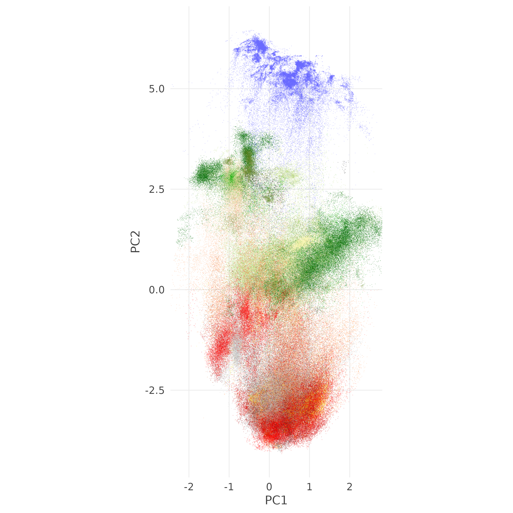

# Introduction

>"The first time was so nice I had to do it twice"
>
> [Chloe Kelly after winning two women's Euros in a row](https://www.instagram.com/reel/DMn43cag19h/), and me after attending a second "summer" school this year.

I went back-to-back doing summer schools, this time in Germany in the [Bochum Urban Climate Summer School (BUCSS 2026)](https://www.geographie.ruhr-uni-bochum.de/klima/bucss.html.en) at the Ruhr University Bochum. This summer school was a bit different from the previous one, as it was more focused on urban climate informatics, but it was also very interesting and I learned a lot. More importantly, I met some of the people whose research I'm citing or using as a basis for my own.

# BUCSS 2026

This school was particularly focused on computational methods to handle climate data of different scales, from global perspective using satellite products or ERA5 data to a more granular scale using information from indoor sensors. It was organised by the [Bochum Urban Climate Lab](https://www.geographie.ruhr-uni-bochum.de/klima/index.html.en), led by [Benjamin Bechtel](https://www.linkedin.com/in/benjamin-bechtel-73987b32a/) and organised by [Vanessa Reinhart](https://www.linkedin.com/in/vanessa-reinhart/).

First of all, the University is massive and has a ton of space which makes it feel like an actual campus. The city is very cosy and walkable, but the city centre is a bit far from the main Uni campus. The school was from Monday to Friday and organised by thematics around the four pillars of Urban Climate Informatics as explained by Benjamin and [Negin Nazarian](https://www.linkedin.com/in/negin-nazarian/) in the introductory lecture: Sensors, Data, Infrastructure and Analytics.

Every day had a mix of lectures, student presentations and practical sessions, with poster/coffee sessions in between. I'm not going to give a detailed account of all the talks, but I do want to highlight a couple of things that caught my eye during the event. One of them was by Professor [Gerald Mills](https://people.ucd.ie/gerald.mills), who is one of the co-authors in the field's (unofficial) bible, [Urban Climates](https://www.cambridge.org/core/books/urban-climates/A02424592E1C7F9B9CD69DAD57A5B50B). He introduced the concept of Metautopia or meteorogically utopian city, that is a ideal city where problems like air pollution and heat islands are minimal. He also explained that most megacities are located in a narrow space of the temperature/precipitation space. Also mentioned the brief history of the field as an organised community but how urban climate has been studied since th first half of the 20th century. [Andreas Christen](https://www.linkedin.com/in/andreas-christen-822a27345/), also an author in the book, presented the criteria for placing a measuring climatic variables *in situ*, both outdoors and indoors, since these environmental metrics can vary substantially depeding on the location in the 3D space. Speaking of, [Simone Kotthaus](https://www.linkedin.com/in/simone-kotthaus-5268928b/) presented the current state-of-the-art methods in vertical sensing of the environment, which is the least studied dimensions in urban climate.

There was a heavy emphasis in the school about crowdsourcing projects and how citizen science project can help augment the data available, with initiatives such as Netatmo and the now defunct [Weather Underground](https://www.wunderground.com/) being mentioned. Some examples include using phone battery to estimate environmental temperature in Sao Paulo, or using vehicles with sensors on them to estimate temperature, while also accounting for the radiation emmitted by the vehicle itself. One of the most interesting cases was the work by [Ariane Middel](https://www.linkedin.com/in/amiddel/) and her [research group](https://shadelab.asu.edu/) at Arizona State University, where they use different sensors to measure the felt temperature (Mean Radiant Temperature) in Phoenix, such as MaRTiny and MaRTy or even a manequin with sensors on it.

The hands-on sessions were very interesting as I hadn't used weather station data before and it was a good chance to apply ML methods to a different type of data. We also had a session on Google Earth Engine by [Mathias Demuzere](https://www.linkedin.com/in/matthiasdemuzere/), who is the responsible for the current [global Local Climate Zone map](https://lcz-generator.rub.de/global-lcz-map) I have used as reference in my work.

# My poster

It was good to final see my work in a more tangible way and it was exciting to present it to the people who have built this field in the last 15 years. I presented a very summarised version of all the experiments and some preliminary results of the LCZ project with geospatial foundation models. After waiting for several weeks for a complete coverage of my cities for Tessera v2, I could finally run the experiments and compare it with AlphaEarth and the v1.1 of Tessera. TLDR: v2 beats everyone in any metric or training approach and it does so with a limited number of parameters, meaning that the learning from its own training actually captures most of the signals that the local climate zones are based on. One important thing to consider is how training labels are handled as embeddings are very good at identifying local patterns, so having minimal information about the morphology of the city, greatly impacts the model. Here is a simple PCA of a Global Average Pooling of the AlphaEarth embeddings for all the 320x320 m patches from the So2St dataset (heavily inspired by the UMAP plot in [James Ball's paper](https://www.sciencedirect.com/science/article/pii/S2666017226001045?via%3Dihub#fig6)).

{width=70%}

You can see more of the poster (including the same scatter plot with Tessera v2) in the[ newly updated section of this project in my website](../projects/lcz-mapping/index.qmd). I will keep updating this in the coming months.

**Shout-out to my sister, Mafe, who helped me with the design of the poster as well as the legends for all the LCZs.**